# AIPlatform Quantum Infrastructure Zero SDK - Architecture Overview

## System Architecture Diagram

## Core Components Architecture

### 1. Quantum Layer Architecture

```mermaid
graph LR
    A[Quantum Layer] --> B[Qiskit Interface]
    A --> C[Quantum Algorithms]
    A --> D[Quantum Safe Crypto]
    
    B --> B1[Runtime Manager]
    B --> B2[Backend Interface]
    B --> B3[Circuit Builder]
    
    C --> C1[VQE/QAOA]
    C --> C2[Grover/Shor]
    C --> C3[Variational Methods]
    
    D --> D1[Kyber Encryption]
    D --> D2[Dilithium Signatures]
    D --> D3[DIDN Framework]
```

### 2. QIZ Infrastructure Architecture

### 3. Federated Quantum AI Architecture

## Data Flow Architecture

### Quantum-Classical Hybrid Processing

### Federated Learning Flow

## Security Architecture

### Zero-Trust Security Model

### Quantum-Safe Cryptography

## Deployment Architecture

### Cross-Platform Deployment

## Integration Architecture

### GenAI Model Integration

### Vision Processing Pipeline

## Performance Architecture

### Quantum-Classical Orchestration

## Monitoring and Observability

### System Health Monitoring

## Conclusion

This architecture overview provides a comprehensive view of the AIPlatform Quantum Infrastructure Zero SDK's design and components. The system is built on a modular, quantum-enhanced foundation that supports cross-platform deployment, federated learning, advanced computer vision, and generative AI integration. The architecture emphasizes security through quantum-safe cryptography and zero-trust principles, while enabling scalable, distributed computing through the Quantum Infrastructure Zero framework.